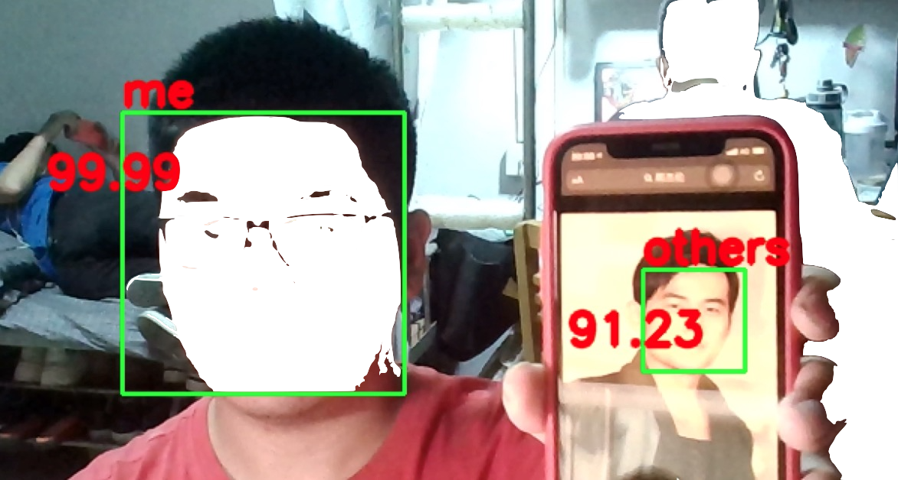
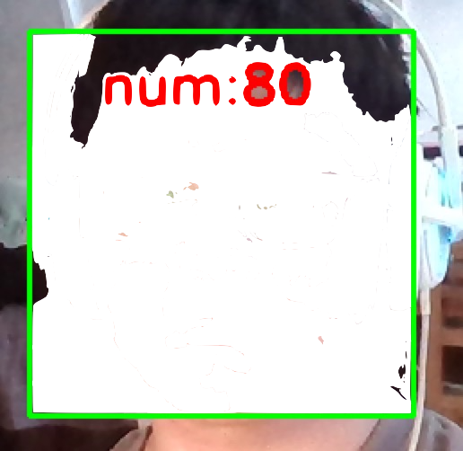
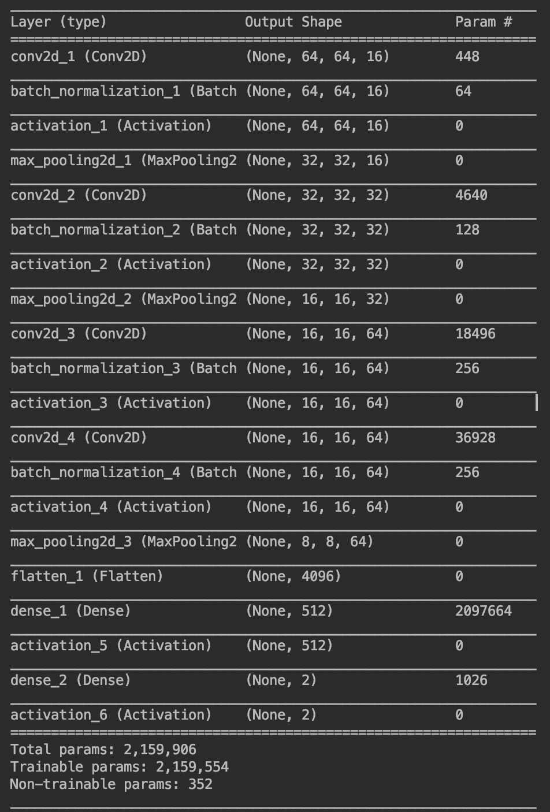

# 一个简单的人脸识别

### 项目用到：
* python3.7
* anaconda
* opencv-python -- 4.1.0.25
* tensorboard -- 1.13.1
* tensorflow  -- 1.13.1
* Keras -- 2.2.4

### 项目结构

* Classifier   分类器，用来检测分类
* Data1  用来存放训练数据
* logs 用来存放生成的tensorboard日志文件
* model 用来存放生成的模型

### 效果

识别效果：

截图过程，终端执行py文件，指定截图数和截图地址

模型训练的输出

